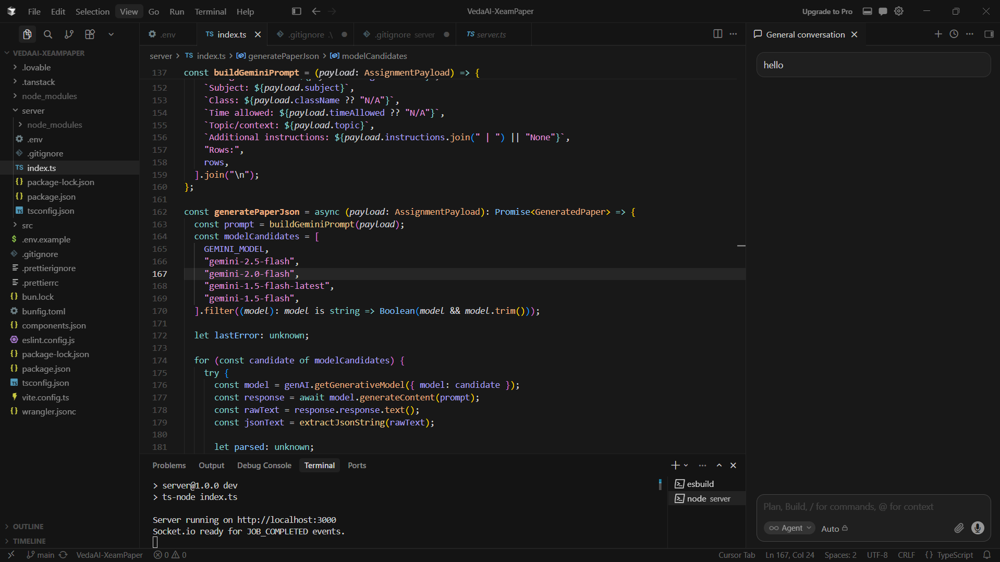

# VedaAI – AI Assessment Creator

An intelligent full-stack platform that allows teachers to generate structured question papers from text or topics using AI. Built during the VedaAI Full-Stack Engineering Assignment.

<video src="Media/VedaAI%20Video.mp4" controls width="100%"></video>

### 🔗 Project Links
- **Live Demo (Frontend):** https://vead-ai-xeam-paper.vercel.app/  (404 - Not FOUND SOORY)
- **Backend API:** https://veadai-xeampaper.onrender.com

---

## 🛠️ The Tech Stack


| Layer | Technology |
| :--- | :--- |
| **Frontend** | Next.js, TypeScript, Tailwind CSS, Lucide Icons |
| **State/Real-time** | Zustand, WebSockets (Socket.io) |
| **Backend** | Node.js, Express, TypeScript |
| **Database** | MongoDB (Data Persistence) |
| **Queue/Jobs** | Redis + BullMQ (For background AI generation) |
| **AI Engine** | Google Gemini API / Claude / OpenAI |

---
## 📸 Project Screenshots

### AI Generation Workflow


### Database Persistence


### Production & Deployments


### Structured Exam Output


---

## ✨ Key Features

- **AI-Powered Generation:** Converts simple instructions into structured sections (A, B, C).
- **Asynchronous Processing:** Uses **BullMQ and Redis** to handle AI generation in the background so the UI never freezes.
- **Real-time Updates:** Progress is pushed to the frontend via **WebSockets** as the paper is being generated.
- **Structured Output:** Beautifully formatted exam papers with difficulty tags (Easy, Moderate, Hard) and marks distribution.
- **PDF Ready:** Clean, printable layout designed for real-world academic use.

---

## 🏗️ Architecture Overview

The system follows a modern event-driven architecture:
1. **Request:** The user submits the assignment form.
2. **Queue:** The Backend validates the request and adds it to a **BullMQ** job queue hosted on **Redis**.
3. **Worker:** A background worker picks up the job, calls the **Gemini AI**, and parses the response into a strict JSON format.
4. **Notify:** Once complete, the backend triggers a **WebSocket** event to the frontend.
5. **Render:** The frontend displays the final structured question paper instantly.

---

## 🚀 Local Setup

1. **Clone the repo:**
   ```bash
   git clone https://github.com
   ```

2. **Setup Backend:**
   ```bash
   cd server
   npm install
   # Create a .env file with MONGODB_URI, REDIS_URL, and GEMINI_API_KEY
   npm start
   ```

3. **Setup Frontend:**
   ```bash
   cd src
   npm install
   # Create a .env file with VITE_API_URL (pointing to backend)
   npm run dev
   ```

---

## 📝 Reflection
This project was developed With The Help of **Vibe Coding** workflow, leveraging **Cursor** and **Lovable** to rapidly prototype and iterate on complex full-stack features like background job processing and real-time state synchronization.

**Submission for VedaAI Hiring Assignment.**
